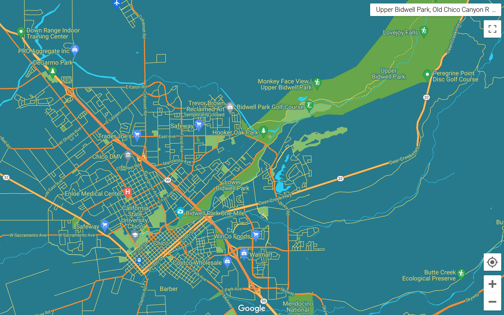
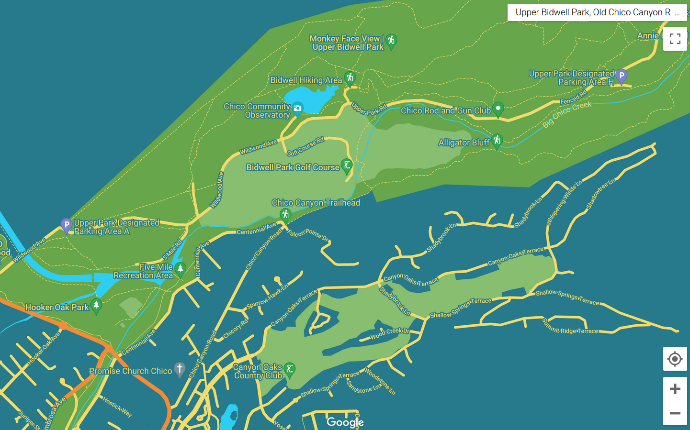
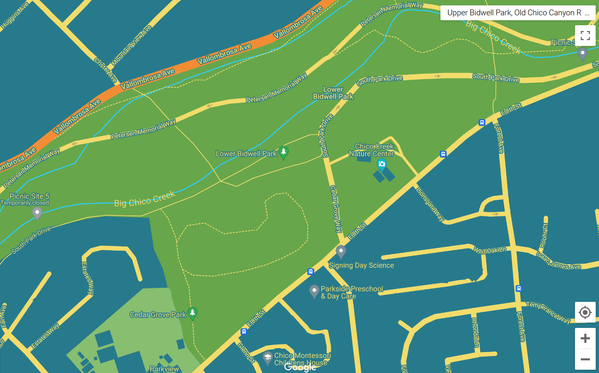

# Assignment 1: Custom Google Map

## Introduction
One of the most prevalent requests for spatial data is user-facing custom maps to lead constituents to key points associated with an organization. In this exercise, we were tasked with choosing a non-profit organization who could leverage an embedded dynamic map, making a prototype that aligns with their mission and design aesthetic. I chose the Chico Creek Nature Center, an associate of the Chico Area Recreation and Parks District. Leveraging the organization's logo, I created a palette that is inspired by natural tones of green, blue, and accents of orange and yellow. I then applied this theme to a custom Google Map using the <a href="https://mapstyle.withgoogle.com/">Map Styling Wizard</a>. Finally, I created a dynamic map prototype that could be embedded in the organization's site.

## Inspiration: Chico Creek Nature Center
When given the choice, I love to make projects associated with nature, parks and recreation, and eco-tourism. I grew up in Chico California, spending much of my childhood in <a href="https://chico.ca.us/bidwell-park">Bidwell Park</a>, one of the largest municipal parks in the United States. <a href="https://www.chicorec.com/chico-creek-nature-center">Chico Creek Nature Center</a> is dedicated to celebrating the region's natural beauty with programming geared towards all ages. For nature enthusiests, this region is alluring but intimidating; without sufficient information (which is currently passed through local word-of-mouth) many travellers have died in the parks by drowning or falling. Chico Creek's position as education center positions them perfectly as ambassadors of safe exploration; curating experiences that introduce visitors to the park and collecting questions that could lead to better information for non-locals.

Chico Area Recreation has <a href="https://chico.ca.us/bidwell-park-maps">detailed static maps</a> of Bidwell Park's expansive 2,500 acres, but this could be complemented by a custom map that a) caters to Chico Creek Nature Center's own programming; and b) is dynamic and exploratory to help visitors plan their trips. The intersection of need, supporting a personal passion, and opportunity to expand Chico Creek's work makes this a perfect test project.

## Palette Selection
I wanted to create a map that feels custom to Chico Creek, giving them ownership away from Chico Area Recreation so that they have a distinct space to highlight their programming. To this end, I sought a palette that would feel at home with their part of the Chico Area Rec website, but also leverage the colors of the organization's logo:

I first trimmed the logo to avoid too many colors coming from the background language and CARD overlay:

I then used <a href="https://color.adobe.com/create/image">Adobe Color</a> to create a custom palette from the image. This palette balances muted green with bright blues and complementing oranges and yellows:

When creating custom maps, it is important to consider visual intuition in addition to adherence to a brand. Because my project focuses so heavily on natural landscapes, green is perfect for park areas themselves, while blue can be used for the background and water features. However, there are sub-sections of the park that are highlighted, such as the golf course, that may be confused with waterways if filled with the same blue. For this reason, I added an additional lighter tone of green (#65A54A) to provide more flexibility.

The final palette was then converted to RGB values for easier input into Google's Style Wizard:

| **Color** | **Bright Blue** | **Muted Blue** | **Bright Green** | **Muted Green** | **Yellow** | **Orange** |
|-----------|-----------------|----------------|------------------|-----------------|------------|------------|
| Hex Code  | #2ECEF2         | #277A8C        | #65A54A          | #67A64B         | #F2DC6B    | #F28D35    |
| Red       | 46              | 39             | 101              | 103             | 242        | 242        |
| Green     | 206             | 122            | 165              | 166             | 220        | 141        |
| Blue      | 242             | 140            | 74               | 75              | 107        | 53         |

## Map Style
Colors in-hand, I worked with <a href="https://mapstyle.withgoogle.com/">Google's MapStyle Wizard</a> to create the custom basemap. I used the muted blue as the base; this contrasted well with the muted green to bring Chico's natural features to the forefront. Highlighted features within the parks are in the previously mentioned light blue, and road ways are in the complement colors - orange for major arteries and yellow for both local streets and hiking trails. All the text were yellow with the muted blue halo, ensuring readibility no matter the background. The full design choices are outlined here in the map's <a href="https://github.com/adorseyt/adorseyt_GIS_Portfolio/blob/main/ChicoCreek.json">JSON</a> file.

## Final Product
Below are the final products of this map design. First is the full extent - which gives a broad picture of the numer of greenspaces in Chico, and contextualizes Bidwell Park within the town as a whole:

While this has the advantage of breadth, it can be a bit cluttered, especially with road, feature, and key point texts being the same color as the roads. This map scale would be appropriate for a general reference, but for trip planning it may be better to zoom in:

This view is perfect for visitors looking for easy access into the park. Newcomers can take Wildwood Avenue to visit the Observatory, enjoy the Golf Course, and divert either up to climb the famous Monkey Face, or park and swim the many watering holes near Alligator Bluff.

Chico Creek Nature Center may also want to highlight the family-friendly facilities near its headquarters. Lower Bidwell park is the smaller and flatter region bisected by Big Chico Creek. Zoomed in to a higher extent, visitors can see the immediate natural area surrounding the Nature Center:

These two extants are better catered to trip planning, allowing visitors to identify routes that will get them to their desired parts of the park. At this level, the crowding of text and sites is reduced, and the yellow/orange stand out from the park and background. However, because the park is so large, the best format would be one that allows visitors to explore. Can we create a dynamic map that begins at the full view, but can be enhanced to identify key routes and features?

### Dynamic Map 

Towards this end, I sought to create an interactive version of the map using Google's API function. Below is a link to the final product, which could be embedded in Chico Creek's website:

[Dynamic Google Map](/A1_ChicoCreek_Map.html)

## Future Work
Chico Creek Nature Center is a much-needed ambassador to a beautiful but under-documented part of California. Their mission to create programming that curates safe and engaging exploration of the parks fosters both local ownership and expansion to the greater community. This map provides a clean base, but could be even more useful when paired with that programming. Chico Creek Nature Center could add points for their moonlight hikes, add safety tips along hiking trails, or promote engagament with photo contests that allow visitors to share their experience. 

